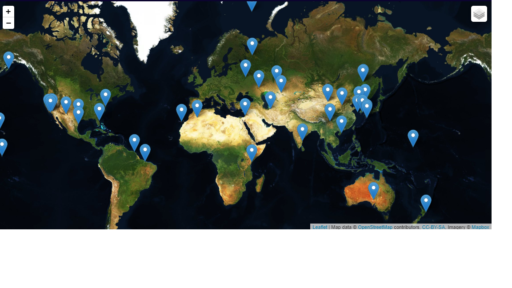
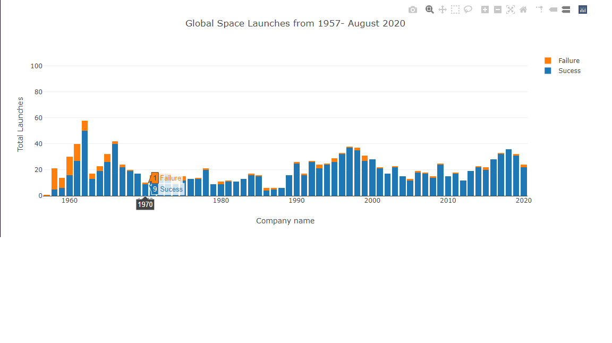
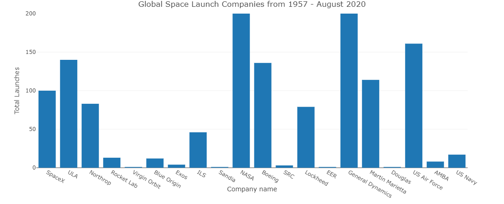
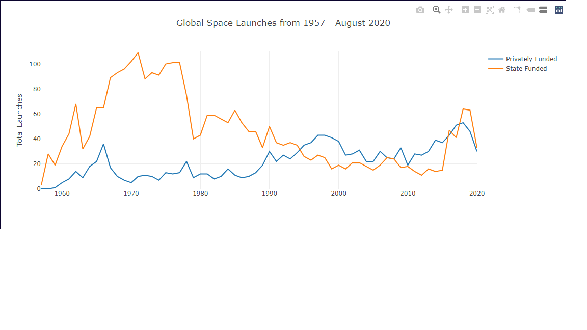
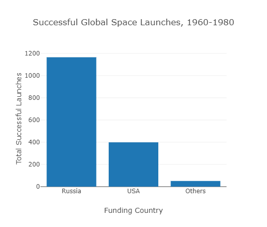
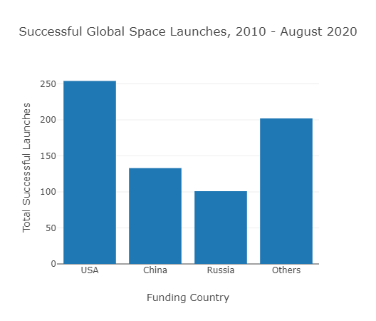

This project showcases an interactive website that displays global space launch data from 1957-August 2020 that was obtained from Kaggle (https://www.kaggle.com/davidroberts13/one-small-step-for-data). We used a Python Flask-powered API with HTML/CSS, JavaScript, and SQL to complete this project. To display the website, run the app.py file.

The maps page uses Leaflet to display an interactive global map with markers for each spot in the world where space launches have occurred.

Upon clicking any marker, a pop-up will display the name of the launch facility, the country of launch, and a total number of launches from that site broken down by successes and failures.
For this part to run properly, a Mapbox API will need to be inserted into the logic.js file under accessToken or a config.js file will need to be included that defines API_KEY as your key.   

The visualization 1 page uses Plotly to display two interactive charts. The first is a stacked bar graph that displays the total number of launches for each year across the years, with successful launches on the bottom and failures stacked on the top of each bar. This graph can be filtered by one dropdown menu that allows the user to select a country of interest.

The second chart is a bar graph displaying all of the company names (both state and private) that funded the launches. This graph is also filtered by the dropdown menu that allows the selection of a country of interest. 

The visualization 2 page uses Plotly to display several interactive charts. The first chart contains two trendlines: one for privately funded launches and one for state-funded launches. Total launches for each year are shown across the years from 1957 to 2020. This chart can be filtered by two dropdown menus: one allows the user to select a country of interest and one allows the user to select whether the missions were successful or failures.

Additionally, there are two buttons next to the dropdown menus. Upon clicking the first button, a bar graph will appear that displays the top countries leading the space race between 1960-1980.

Upon clicking the second button, a second bar graph will appear that displays the countries leading the space race from 2010-2020.

 
